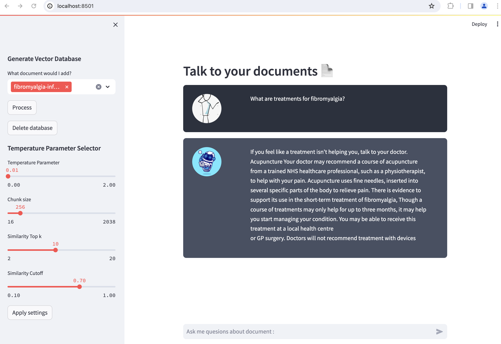

# RQA_Practice
A repo where I try out Retrival Question Answer (RQA) examples presented in different libraries (LangChain, Llama_index) using scripts or a Graphical User Interface. Anyone interested can use and modify the scripts as needed.

## Advanced RAG
This repo contains scripts and a GUI developed using streamlit where the user can load a PDF file and select one from among two advanced retrival techniques ( Scentence Window or Auto Merging Retrival). It also allows the possibility to select a large language model from the dropdown menu. It works with ollama api and all the popular llm models (llama2, mistral, gemma)  are generally available with ollama. Before selecting any of the models in GUI, they should be first tried out with ollama api directly by executing `ollama run llama2:7b`. Other possible models are listed [here](https://ollama.com/library)

- Sentence Window Retrival - It uses the `SentenceWindowNodeParser` class where it breaks down the uploaded documents into sentences and creates nodes with a window of text around it. Vecotr Indices are computed from the sentence window nodes. After that a `MetadataReplacementPostProcessor` is used to reshuffle the retrieved similarity indices based on query and `SentenceTransformerRerank` is used to rerank them before coming out with a synthesized reponse.

- Auto Merging Retrival - It creates some set of leaf nodes based on specified token dimension and then recursively merges into smaller contexts based on query. On doing so queries that are separated out will be merged into a larger context. It uses a new text parser called `HierrarchicalNodeParser` that does the splitting pf texts into smaller nodes.

# RQA Llama Index

This repo contains a script as well as a GUI developed using streamlit where the user can load up a PDF file, create an embedding database, ask questions and retrieve response using provided llama_index classes. The GUI can be started using `streamlit run RQA_streamlit_docs.py`. It should work with any GGUF model, has been tested only with LLama-7B, Mistral-7B. The model can be automatically downloaded by setting it with required huggingface url under `load_llm` function in `model_url` or if it has already been downloaded locally then providing it in `model_path`. A sample PDF file for testing has also been included.

## To Do
- [ ] Add some evaluation scripts to test how the different techniques compare to each other

### Extra Scripts
* `llama_index_test2.py` can be executed if GUI is not needed
* `llama_index_test.py` shows a RQA example without using RetrieverQueryEngine but it is not working properly. However it has an example of how to use tokens
